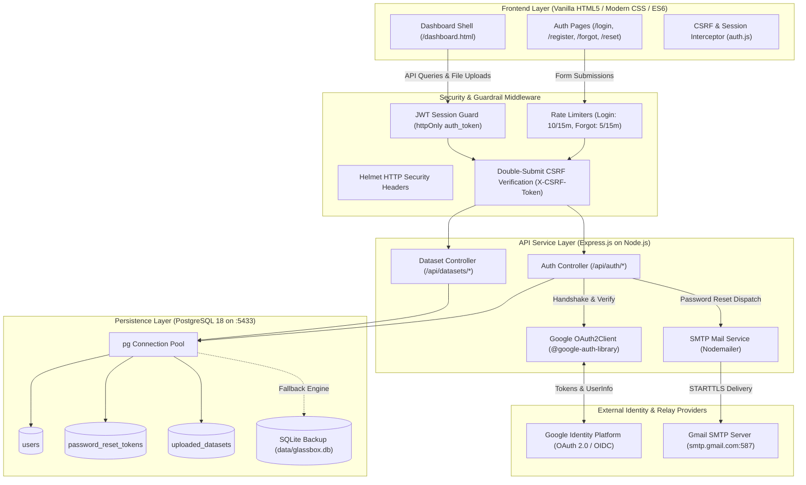

# GlassBox-BI — Enterprise Analytics Platform

**Multi-Agent Explainable AI Framework for Business Analytics, Forecasting, and Decision Intelligence**

---

## 📌 Phase 1 Scope & Status

> **Phase 1: Authentication System, Security Foundation & Dashboard Shell**  
> **Status:** ✅ Complete & Production-Ready | All 26 Automated Integration Tests Passing

Phase 1 establishes the core infrastructure for GlassBox-BI: a secure dual-engine authentication service (PostgreSQL primary with SQLite fallback), Google OAuth 2.0 integration, Gmail SMTP password recovery, session and CSRF guardrails, and an enterprise analytics dashboard shell built with responsive CSS Grid/Flexbox.

---

## 🏛️ System Architecture & Data Flow



---

## 🎨 Design System & Aesthetic

- **Aesthetic Direction**: Modeled after enterprise analytics platforms (Tableau, Power BI). Clean, high-contrast, professional, and accessible.
- **Color Palette**:
  - Primary Brand / Backgrounds: Deep Midnight Navy (`#1a2332`, `#0f172a`)
  - Canvas & Panels: Crisp Off-White & Slate (`#f8fafc`, `#ffffff`, `#f1f5f9`)
  - Primary Accent & CTAs: Enterprise Teal (`#0d9488`, `#2dd4bf`)
  - Status Indicators: Emerald Green (`#10b981`), Amber (`#d97706`), Crimson (`#ef4444`)
- **Typography**: Clean sans-serif via Google Font `Inter` with hierarchical scale.
- **Responsive Breakpoints**:
  - **Desktop** ($1440\text{px}+$): Two-column analytical layout with spacious main work area and 5 stacked agent cards.
  - **Laptop** ($1024\text{px} - 1439\text{px}$): Fluid CSS Grid layout maintaining side panel balance.
  - **Tablet** ($768\text{px} - 1023\text{px}$): Navbar collapses into hamburger toggle; agent cards reflow into a 2-column grid.
  - **Mobile** ($< 768\text{px}$): Reflows into a single-column layout with slide-out navigation drawer.

---

## 🖥️ Pages & User Interface

### 1. Login Page (`/login.html`)
- Fields: Work Email and Password with inline real-time error handling.
- Actions: Standard credential login and official **"Continue with Google"** OAuth 2.0 flow.
- Direct navigation to Registration and Password Reset.
- Protected against brute-force attacks via IP rate limiting.

### 2. Register Page (`/register.html`)
- Fields: Full Name, Work Email, Password, Confirm Password.
- Interactive live password strength checklist:
  - Minimum 8 characters
  - At least 1 number ($0-9$)
  - At least 1 special character (`!@#$%^&*...`)
  - Passwords match confirmation
- Salted bcrypt hash generation with automatic redirection to Login upon completion.

### 3. Forgot Password Page (`/forgot-password.html`)
- Field: Registered Email.
- Generates a cryptographically secure 32-byte token with a 1-hour expiration window.
- Computes and stores the SHA-256 hash in the database, sending the raw token link through Gmail SMTP.
- Enumeration-safe confirmation: *"If this email exists in our records, a password reset link has been sent."*

### 4. Reset Password Page (`/reset-password.html`)
- Validates token authenticity and expiration on load.
- Enforces password entropy requirements on the new password.
- Atomically updates password hash and marks token as `used = TRUE` to prevent replay attacks.

### 5. Analytics Dashboard Shell (`/dashboard.html`)
- **Top Navigation Bar**:
  - GlassBox-BI brand icon with enterprise badge.
  - Global search / command palette trigger: **"Ask GlassBox-BI"** with `Ctrl+K` keyboard shortcut.
  - Profile menu displaying user avatar, full name, email, and one-click Logout.
  - Slide-out mobile drawer on tablet/mobile screens.
- **Collapsible Onboarding Guide**:
  - 5-step walkthrough (*Upload Data*, *Select Agent*, *View Results*, *Ask GlassBox-BI*, *Export Reports*).
  - State persisted via `localStorage` (expand/collapse state remains on reload).
- **Dataset Ingestion Zone**:
  - Drag-and-drop file upload target with file selector.
  - Strict format validation accepting `.csv`, `.xls`, and `.xlsx` up to 25MB.
  - Real-time progress bar.
  - Dataset listing table showing format badge, row/column counts, file size, timestamp, and delete action.
- **Interactive Multi-Agent Panel**:
  - 5 static agent preview cards ready for Phase 2 agent logic:
    1. **Data Preprocessing Agent**
    2. **Forecasting Agent**
    3. **Evaluation Agent**
    4. **Business Intelligence Agent**
    5. **Explainable AI (XAI) Agent**

---

## 🛡️ Security & Authentication Protocols

| Feature | Implementation Details |
| :--- | :--- |
| **Password Hashing** | Salted `bcrypt` hashing with **12 cost rounds**. Plaintext passwords are never logged or stored. |
| **Session Management** | Signed JSON Web Tokens (`HS256`) stored in `httpOnly`, `SameSite=Lax` cookies with 7-day TTL. |
| **CSRF Defense** | Double-submit cookie pattern. All mutating HTTP methods (`POST`, `PUT`, `DELETE`) require a valid `X-CSRF-Token` header matching the `csrfToken` cookie. |
| **OAuth 2.0 Security** | Built with Google's official `OAuth2Client`. Utilizes cryptographically random `state` cookies to thwart OAuth login-CSRF. |
| **Reset Token Security** | Generated via `crypto.randomBytes(32)`. Only SHA-256 digests are stored in the database. Strictly invalidated upon single use (`used = TRUE`). |
| **Rate Limiting** | `express-rate-limit` enforces strict thresholds: 10 attempts/15 min for login, 5 attempts/15 min for password recovery. |
| **Data Isolation** | Multi-part uploads managed with `multer` into isolated storage directories with sanitized naming. |

---

## 🗄️ Database Architecture

GlassBox-BI uses a dual-engine persistence layer defined in `server/db.js`:
- **Primary Engine**: **PostgreSQL 18** (defaulting to port `5433` or `5432`).
- **Fallback Engine**: Embedded **SQLite** (`data/glassbox.db`) ensures zero-breakage development if PostgreSQL is temporarily unavailable.

### Database Schema (`server/scripts/schema.sql`):

```sql
-- 1. Users Table
CREATE TABLE IF NOT EXISTS users (
    id UUID PRIMARY KEY DEFAULT gen_random_uuid(),
    name VARCHAR(255) NOT NULL,
    email VARCHAR(255) UNIQUE NOT NULL,
    password_hash VARCHAR(255),
    google_id VARCHAR(255) UNIQUE,
    avatar_url TEXT,
    created_at TIMESTAMP WITH TIME ZONE DEFAULT CURRENT_TIMESTAMP,
    updated_at TIMESTAMP WITH TIME ZONE DEFAULT CURRENT_TIMESTAMP
);

-- 2. Password Reset Tokens Table
CREATE TABLE IF NOT EXISTS password_reset_tokens (
    id UUID PRIMARY KEY DEFAULT gen_random_uuid(),
    user_id UUID NOT NULL REFERENCES users(id) ON DELETE CASCADE,
    token_hash VARCHAR(64) NOT NULL,
    expires_at TIMESTAMP WITH TIME ZONE NOT NULL,
    used BOOLEAN DEFAULT FALSE,
    created_at TIMESTAMP WITH TIME ZONE DEFAULT CURRENT_TIMESTAMP
);

-- 3. Uploaded Datasets Table
CREATE TABLE IF NOT EXISTS uploaded_datasets (
    id UUID PRIMARY KEY DEFAULT gen_random_uuid(),
    user_id UUID NOT NULL REFERENCES users(id) ON DELETE CASCADE,
    filename VARCHAR(255) NOT NULL,
    original_name VARCHAR(255) NOT NULL,
    mime_type VARCHAR(100) NOT NULL,
    size_bytes BIGINT NOT NULL,
    row_count INTEGER,
    column_count INTEGER,
    columns_json JSONB,
    uploaded_at TIMESTAMP WITH TIME ZONE DEFAULT CURRENT_TIMESTAMP
);
```

---

## 📡 API Reference

### Authentication Endpoints (`/api/auth`)
| Method | Endpoint | Description | Auth Required |
| :--- | :--- | :--- | :--- |
| `POST` | `/api/auth/register` | Register new user with name, email, password | No (CSRF) |
| `POST` | `/api/auth/login` | Login with email and password (Rate-limited) | No (CSRF) |
| `GET` | `/api/auth/me` | Fetch currently authenticated user profile | **Yes (JWT)** |
| `POST` | `/api/auth/logout` | Clear `auth_token` and `csrfToken` cookies | **Yes (JWT)** |
| `POST` | `/api/auth/forgot-password` | Request password reset email via SMTP (Rate-limited) | No (CSRF) |
| `POST` | `/api/auth/reset-password` | Reset password using SHA-256 token | No (CSRF) |
| `GET` | `/api/auth/google` | Initiate Google OAuth 2.0 handshake | No |
| `GET` | `/api/auth/google/callback`| Complete OAuth code exchange & issue session | No |

### Dataset Management Endpoints (`/api/datasets`)
| Method | Endpoint | Description | Auth Required |
| :--- | :--- | :--- | :--- |
| `POST` | `/api/datasets/upload` | Upload `.csv`, `.xls`, `.xlsx` dataset file | **Yes (JWT + CSRF)** |
| `GET` | `/api/datasets` | List all datasets uploaded by current user | **Yes (JWT)** |
| `DELETE`| `/api/datasets/:id` | Delete uploaded dataset record and disk file | **Yes (JWT + CSRF)** |

### System & Health Endpoints
| Method | Endpoint | Description | Auth Required |
| :--- | :--- | :--- | :--- |
| `GET` | `/api/health` | Returns server uptime, active DB engine, and status | No |

---

## ⚙️ Configuration & Environment Variables

Copy `.env.example` to `.env` and configure your credentials:

```env
# Application Port & Environment
PORT=3000
NODE_ENV=development
APP_URL=http://localhost:3000

# Security Secrets
JWT_SECRET=your_super_secret_jwt_key_here
SESSION_SECRET=your_session_secret_key_here

# PostgreSQL Database Configuration
DB_TYPE=postgres
PGHOST=localhost
PGPORT=5433
PGUSER=postgres
PGPASSWORD=your_postgres_password
PGDATABASE=glassbox_bi

# Google OAuth 2.0 Credentials
GOOGLE_CLIENT_ID=your_client_id.apps.googleusercontent.com
GOOGLE_CLIENT_SECRET=your_client_secret
GOOGLE_CALLBACK_URL=http://localhost:3000/api/auth/google/callback

# SMTP / Email Configuration (Gmail App Password)
SMTP_HOST=smtp.gmail.com
SMTP_PORT=587
SMTP_SECURE=false
SMTP_USER=your_email@gmail.com
SMTP_PASS=your_gmail_app_password
EMAIL_FROM="GlassBox-BI Security" <no-reply@glassbox-bi.ai>
```

---

## 🚀 Getting Started

### 1. Install Dependencies
```bash
npm install
```

### 2. Initialize Database & Migrate Schema
```bash
npm run db:init
```
*This connects to PostgreSQL on port 5433, applies `server/scripts/schema.sql`, and safely migrates any existing user records.*

### 3. Run Automated Integration Tests
```bash
npm test
```
*Runs the 26-test end-to-end integration suite covering registration, bcrypt hashing, login rate limits, CSRF token validation, password reset flow, and dataset file uploads.*

### 4. Start the Application Server
```bash
npm start
```
- Open in Browser: [http://localhost:3000](http://localhost:3000) or [http://localhost:3000/login.html](http://localhost:3000/login.html)
- Verify Health: [http://localhost:3000/api/health](http://localhost:3000/api/health)
