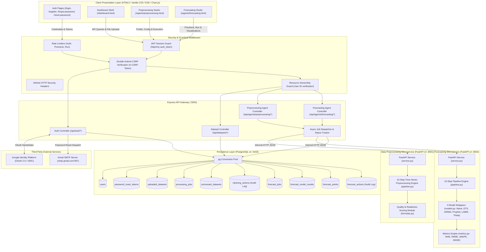

# GlassBox-BI — Enterprise Analytics Platform

**Multi-Agent Explainable AI Framework for Business Analytics, Forecasting, and Decision Intelligence**

---

## 🚀 Overview

GlassBox-BI is an enterprise business intelligence platform designed with a clean, analytical aesthetic (inspired by Tableau and Power BI). The platform provides a secure dual-engine authentication service (PostgreSQL primary with SQLite fallback), Google OAuth 2.0 integration, Gmail SMTP password recovery, session and CSRF guardrails, an analytics dashboard shell, and an end-to-end **Data Preprocessing Agent** that prepares raw tabular metrics for time-series forecasting.

---

## 🏛️ System Architecture & Data Flow



---

## 🤖 Data Preprocessing Agent

The **Data Preprocessing Agent** transforms raw tabular datasets into clean, continuous, gap-free time-series data ready for statistical and machine-learning forecasting.

### Key Architectural Tenets:
1. **Explainability**: Every action produces an entry in an immutable audit trail (`cleaning_actions`) with the step name, column affected, method used, rows/cells affected, and a human-readable sentence.
2. **Time-Series Aware**: Automatically detects chronological indices, infers calendar frequencies (`D`, `W`, `M`, `Q`, `Y`), aggregates duplicate timestamps, and interpolates period gaps.
3. **No Scaling / Normalization Guarantee**: The agent strictly avoids normalization, standardization (z-score scaling), or min-max scaling to prevent data leakage across train/validation splits (scaling is deferred to the Forecasting Agent).
4. **Internal Microservice Isolation**: Built with Python FastAPI, `pandas`, and `numpy`. Operates internally on port `8001` and is never exposed directly to the public browser; the Express API Gateway handles all authentication and dataset ownership before proxying requests.

### 10-Step Transformation Pipeline (Sequential Execution):
1. **LOAD**: Reads `.csv`, `.xls`, or `.xlsx`. Sniffs delimiter and encoding (`utf-8`, `latin-1`, etc.). For Excel files, supports multi-sheet selection (defaulting to the first sheet). Enforces maximum row processing limits.
2. **PROFILE (Before Cleaning)**: Profiles row/column counts, data types, missing value percentages, duplicate rows, constant columns, and numeric distributions. Calculates the initial **Data Quality Score (Before)** (0–100).
3. **STANDARDIZE**: Trims whitespace, standardizes column headers to clean `snake_case`, converts string placeholders (`"n/a"`, `"null"`, `"-"`, `"?"`) to `NaN`, strips currency symbols and percentage signs from numeric candidates, and parses dates robustly.
4. **DETECT COLUMNS**: Auto-detects the date/time column and suggests the primary forecast target column based on token scoring, variance, and completeness.
5. **DUPLICATES**: Removes exact duplicate rows. For duplicate timestamps sharing the same date, aggregates values using configurable strategies (default: `sum` for target column, `mean` for other numeric columns).
6. **MISSING VALUES**: Drops columns exceeding the sparse threshold (default 60% missing). For the target column, applies time-series linear interpolation followed by forward/backward fill for boundary edges. Other numeric columns are imputed using medians; categorical columns use the mode or `"Unknown"`.
7. **OUTLIERS**: Identifies extreme anomalies using IQR (1.5x) or Z-score (3.0x). Default action is **Cap (Winsorize)** to statistical boundaries—never silently deleting rows.
8. **TIME-SERIES ALIGNMENT**: Sorts chronologically, infers uniform frequency, constructs a complete calendar index, and interpolates the target across inserted missing periods.
9. **VALIDATE READINESS**: Checks observation thresholds ($\ge 50$ recommended, $< 30$ fails), non-zero target variance, monotonicity, and continuity. Calculates the **Forecast Readiness Score** (0–100) and **Data Quality Score (After)**.
10. **EXPORT**: Persists cleaned CSV to `/processed/{user_id}/{job_id}/cleaned_data.csv` and writes a machine-readable JSON report with sample previews and the audit log.

---

## 🗄️ Database Architecture (PostgreSQL 18)

All operations are backed by PostgreSQL (port `5433` or `5432`) with an embedded SQLite fallback:

```sql
-- 1. Users Table
CREATE TABLE users (
    id SERIAL PRIMARY KEY,
    full_name VARCHAR(255) NOT NULL,
    email VARCHAR(255) UNIQUE NOT NULL,
    password_hash VARCHAR(255),
    auth_provider VARCHAR(50) DEFAULT 'local',
    google_id VARCHAR(255),
    created_at TIMESTAMP WITH TIME ZONE DEFAULT CURRENT_TIMESTAMP,
    updated_at TIMESTAMP WITH TIME ZONE DEFAULT CURRENT_TIMESTAMP
);

-- 2. Password Reset Tokens
CREATE TABLE password_reset_tokens (
    id SERIAL PRIMARY KEY,
    user_id INTEGER NOT NULL REFERENCES users(id) ON DELETE CASCADE,
    token VARCHAR(255) UNIQUE NOT NULL,
    expires_at TIMESTAMP WITH TIME ZONE NOT NULL,
    used BOOLEAN DEFAULT FALSE,
    created_at TIMESTAMP WITH TIME ZONE DEFAULT CURRENT_TIMESTAMP
);

-- 3. Uploaded Datasets
CREATE TABLE uploaded_datasets (
    id SERIAL PRIMARY KEY,
    user_id INTEGER NOT NULL REFERENCES users(id) ON DELETE CASCADE,
    file_name VARCHAR(255) NOT NULL,
    file_type VARCHAR(100) NOT NULL,
    file_size BIGINT NOT NULL,
    storage_path TEXT NOT NULL,
    uploaded_at TIMESTAMP WITH TIME ZONE DEFAULT CURRENT_TIMESTAMP,
    status VARCHAR(50) DEFAULT 'ready'
);

-- 4. Preprocessing Jobs
CREATE TABLE processing_jobs (
    id UUID PRIMARY KEY DEFAULT gen_random_uuid(),
    user_id INTEGER NOT NULL REFERENCES users(id) ON DELETE CASCADE,
    dataset_id INTEGER NOT NULL REFERENCES uploaded_datasets(id) ON DELETE CASCADE,
    status VARCHAR(50) DEFAULT 'queued',
    config_json JSONB,
    error_message TEXT,
    started_at TIMESTAMP WITH TIME ZONE,
    finished_at TIMESTAMP WITH TIME ZONE,
    created_at TIMESTAMP WITH TIME ZONE DEFAULT CURRENT_TIMESTAMP
);

-- 5. Processed Datasets
CREATE TABLE processed_datasets (
    id UUID PRIMARY KEY DEFAULT gen_random_uuid(),
    job_id UUID NOT NULL REFERENCES processing_jobs(id) ON DELETE CASCADE,
    user_id INTEGER NOT NULL REFERENCES users(id) ON DELETE CASCADE,
    source_dataset_id INTEGER NOT NULL REFERENCES uploaded_datasets(id) ON DELETE CASCADE,
    file_path TEXT NOT NULL,
    rows_before INTEGER,
    rows_after INTEGER,
    columns_before INTEGER,
    columns_after INTEGER,
    date_column VARCHAR(255),
    target_column VARCHAR(255),
    frequency VARCHAR(50),
    quality_score_before NUMERIC(5,2),
    quality_score_after NUMERIC(5,2),
    readiness_score NUMERIC(5,2),
    created_at TIMESTAMP WITH TIME ZONE DEFAULT CURRENT_TIMESTAMP
);

-- 6. Explainability Audit Log Actions
CREATE TABLE cleaning_actions (
    id SERIAL PRIMARY KEY,
    job_id UUID NOT NULL REFERENCES processing_jobs(id) ON DELETE CASCADE,
    step_order INTEGER,
    step_name VARCHAR(100),
    column_name VARCHAR(255),
    action VARCHAR(100),
    method VARCHAR(100),
    rows_affected INTEGER,
    description TEXT,
    created_at TIMESTAMP WITH TIME ZONE DEFAULT CURRENT_TIMESTAMP
);
```

---

## 📡 API Reference

### Preprocessing Agent Endpoints (`/api/agents/preprocessing`)
| Method | Endpoint | Description | Auth Required |
| :--- | :--- | :--- | :--- |
| `POST` | `/api/agents/preprocessing/profile` | Inspect dataset health (Steps 1–4) & return suggestions | **Yes (JWT + CSRF)** |
| `POST` | `/api/agents/preprocessing/run` | Dispatch full 10-step asynchronous pipeline run | **Yes (JWT + CSRF)** |
| `GET` | `/api/agents/preprocessing/jobs/:jobId` | Poll job execution status (`queued`, `running`, `completed`) | **Yes (JWT)** |
| `GET` | `/api/agents/preprocessing/jobs/:jobId/report` | Fetch full results, before/after scores, checklist, & audit trail | **Yes (JWT)** |
| `GET` | `/api/agents/preprocessing/jobs/:jobId/preview` | Preview first 50 rows of cleaned time-series data | **Yes (JWT)** |
| `GET` | `/api/agents/preprocessing/jobs/:jobId/download`| Stream and download cleaned `.csv` file | **Yes (JWT)** |
| `GET` | `/api/agents/preprocessing/jobs` | Retrieve user's historical preprocessing jobs | **Yes (JWT)** |

### Core Authentication & Dataset Endpoints
| Method | Endpoint | Description | Auth Required |
| :--- | :--- | :--- | :--- |
| `POST` | `/api/auth/register` | Register new user account | No (CSRF) |
| `POST` | `/api/auth/login` | Login with credentials (Rate-limited) | No (CSRF) |
| `GET` | `/api/auth/me` | Fetch authenticated user profile | **Yes (JWT)** |
| `POST` | `/api/auth/logout` | Invalidate session cookies | **Yes (JWT)** |
| `POST` | `/api/auth/forgot-password` | Dispatch reset link via Gmail SMTP | No (CSRF) |
| `POST` | `/api/auth/reset-password` | Apply new password using single-use SHA-256 token | No (CSRF) |
| `GET` | `/api/auth/google` | Initiate Google OAuth 2.0 handshake | No |
| `GET` | `/api/auth/google/callback`| Complete Google OAuth handshake | No |
| `POST` | `/api/datasets/upload` | Upload `.csv`, `.xls`, `.xlsx` file (max 50MB) | **Yes (JWT + CSRF)** |
| `GET` | `/api/datasets` | List user's ingested datasets | **Yes (JWT)** |
| `DELETE`| `/api/datasets/:id` | Remove dataset record and storage file | **Yes (JWT + CSRF)** |
| `GET` | `/api/health` | System diagnostics & PostgreSQL engine status | No |

---

## ⚙️ Configuration & Environment Variables

Copy `.env.example` to `.env` and set your credentials:

```env
# Application Port & URLs
PORT=3000
NODE_ENV=development
APP_URL=http://localhost:3000

# Security Secrets
JWT_SECRET=your_jwt_secret_key_here
CSRF_SECRET=your_csrf_secret_key_here

# PostgreSQL Database Configuration
DB_TYPE=postgres
PGHOST=localhost
PGPORT=5433
PGUSER=postgres
PGPASSWORD=your_postgres_password
PGDATABASE=glassbox_bi

# Google OAuth 2.0 Credentials
GOOGLE_CLIENT_ID=your_google_client_id.apps.googleusercontent.com
GOOGLE_CLIENT_SECRET=your_google_client_secret
GOOGLE_CALLBACK_URL=http://localhost:3000/api/auth/google/callback

# SMTP / Email Configuration (Gmail App Password)
SMTP_HOST=smtp.gmail.com
SMTP_PORT=587
SMTP_SECURE=false
SMTP_USER=your_email@gmail.com
SMTP_PASS=your_gmail_app_password
EMAIL_FROM="GlassBox-BI Security" <no-reply@glassbox-bi.ai>

# Preprocessing Agent Microservice
AGENT_SERVICE_URL=http://127.0.0.1:8001
AGENT_PORT=8001

# Forecasting Agent Microservice
FORECASTING_AGENT_URL=http://127.0.0.1:8002
FORECASTING_PORT=8002
```

---

## 📈 Forecasting Agent

The **Forecasting Agent** consumes the clean, forecast-ready time-series dataset produced by the Preprocessing Agent (`processed_datasets`), trains a portfolio of competitive forecasting models on a chronological training set, evaluates them on an out-of-sample holdout without data leakage, objectively ranks them, refits the winning model on all data, and generates multi-step future forecasts with 80% and 95% confidence intervals.

### Model Portfolio (Common Interface: `fit`, `predict`, `predict_interval`, `get_metadata`):
1. **Seasonal Naive** (Baseline, always runs): Repeats the preceding seasonal cycle values based on dataset frequency.
2. **ETS / Exponential Smoothing** (`statsmodels`): Automatic additive/multiplicative trend and seasonality order selection.
3. **ARIMA / SARIMA** (`statsmodels`): Autoregressive integrated moving average with AIC-driven grid search.
4. **Prophet** (`prophet`): Additive/multiplicative Bayesian generalized additive model for trend and calendar seasonality.
5. **LightGBM** (`lightgbm`): Gradient boosted decision trees using strictly backward-looking lag, rolling, and calendar features with recursive multi-step forecasting.
6. **Theta** (`statsmodels`): Theta method decomposing the series into dual curvature and trend lines.

### 10-Step Pipeline Sequence:
1. **LOAD**: Reads cleaned time-series data using stored date, target column, and frequency metadata.
2. **TIME-SERIES VALIDATION**: Verifies sorted, monotonic dates, zero target nulls, non-constant values, and minimum observation limits (fails below 24, warns below 50).
3. **MODEL ELIGIBILITY CHECK**: Evaluates length constraints and seasonal cycles per model with logged reasons.
4. **FEATURE ENGINEERING** (LightGBM): Generates lag features (1, 2, 3, seasonal), rolling window statistics (shifted backward), and calendar features.
5. **CHRONOLOGICAL SPLIT**: Holds out the last $H = \min(\text{horizon}, 0.20 \times N)$ observations (minimum 3) without shuffling.
6. **TRAIN & PREDICT HOLDOUT**: Fits models on train split only; generates out-of-sample predictions (recursive for LightGBM).
7. **EVALUATION & BENCHMARKING**: Computes holdout MAE, RMSE, MAPE (handles zero actuals safely), sMAPE, and MASE against the Seasonal Naive baseline.
8. **MODEL SELECTION**: Ranks models by RMSE (or MAE / sMAPE). Flags whether models beat baseline and selects the objective winner.
9. **REFIT & FORECAST**: Refits the winning model on all $N$ observations and forecasts the target horizon with 80% and 95% prediction intervals.
10. **EXPORT & XAI ARTIFACTS**: Exports `forecast.csv`, `holdout_predictions.csv`, `report.json`, model binary (`model.joblib`), and feature metadata (`metadata.json`) for downstream Explainable AI (XAI) analysis.

### Database Tables (PostgreSQL):
- `forecast_jobs`: UUID primary key, user ID, processed dataset ID, status, config JSONB, horizon, selected metric, winner model, error message, execution timestamps.
- `forecast_model_results`: Per-model evaluations (MAE, RMSE, MAPE, sMAPE, MASE, beats_baseline flag, rank, hyperparameters JSONB, training duration, skip reasons).
- `forecast_points`: Predicted future timestamps, point forecasts, and 80%/95% prediction interval bands.
- `forecast_actions`: Granular explainability audit trail logging each pipeline step and decision.

### Express API Endpoints (`/api/agents/forecasting/*`):
- `GET /api/agents/forecasting/datasets`: Lists user's completed preprocessed datasets.
- `POST /api/agents/forecasting/precheck`: Pre-validates series and determines model eligibility with plain-English rationales.
- `POST /api/agents/forecasting/run`: Asynchronously launches the 10-step forecasting pipeline.
- `GET /api/agents/forecasting/jobs/:jobId`: Returns job status for real-time polling.
- `GET /api/agents/forecasting/jobs/:jobId/report`: Full report with winner banner, leaderboard, and audit log.
- `GET /api/agents/forecasting/jobs/:jobId/forecast`: Historical actuals, holdout predictions, and future forecasts with confidence intervals.
- `GET /api/agents/forecasting/jobs/:jobId/download`: Downloads `forecast.csv`.
- `GET /api/agents/forecasting/jobs`: User's historical forecasting runs.

---

## 🏃 Running the Platform

### 1. Install Dependencies
```bash
# Install Node.js backend packages
npm install

# Install Python Preprocessing & Forecasting microservice requirements
pip install -r agents/preprocessing/requirements.txt
pip install -r agents/forecasting/requirements.txt
```

> **Python Compatibility Note**: Compatible with Python 3.11, 3.12, 3.13, and 3.14. All core forecasting libraries (`statsmodels`, `prophet`, `lightgbm`, `fastapi`, `uvicorn`, `scipy`, `pandas`, `numpy`, `joblib`, `scikit-learn`) are verified. Each model wrapper is isolated and fails gracefully if an optional dependency is missing.

### 2. Initialize Database Schema
```bash
npm run db:init
```

### 3. Start All Services Concurrently
```bash
npm run start:all
```
*This command starts all three services simultaneously:*
- **Express Backend API Gateway**: `http://localhost:3000`
- **Data Preprocessing Agent Microservice**: `http://127.0.0.1:8001`
- **Forecasting Agent Microservice**: `http://127.0.0.1:8002`

To start services individually:
```bash
# Terminal 1: Python Preprocessing Microservice (port 8001)
npm run agent:preprocessing:start

# Terminal 2: Python Forecasting Microservice (port 8002)
npm run agent:forecasting:start

# Terminal 3: Express Backend Gateway (port 3000)
npm start
```

### 4. Running Tests
```bash
# Run all test suites across the platform (Auth + Preprocessing + Forecasting + Python tests)
npm run test:all

# Run Core Auth & Database Tests
npm test

# Run Preprocessing Agent E2E Tests
npm run test:preprocessing

# Run Forecasting Agent E2E Tests
npm run test:forecasting

# Run Python Unit Tests
npm run agent:preprocessing:test
npm run agent:forecasting:test
```

### 5. Accessing in Browser
- **Dashboard**: [http://localhost:3000/dashboard.html](http://localhost:3000/dashboard.html)
- **Data Preprocessing Agent**: [http://localhost:3000/agents/preprocessing.html](http://localhost:3000/agents/preprocessing.html)
- **Forecasting Agent**: [http://localhost:3000/agents/forecasting.html](http://localhost:3000/agents/forecasting.html)
- **Login / Register**: [http://localhost:3000/login.html](http://localhost:3000/login.html)
- **System Health Diagnostics**: [http://localhost:3000/api/health](http://localhost:3000/api/health)

